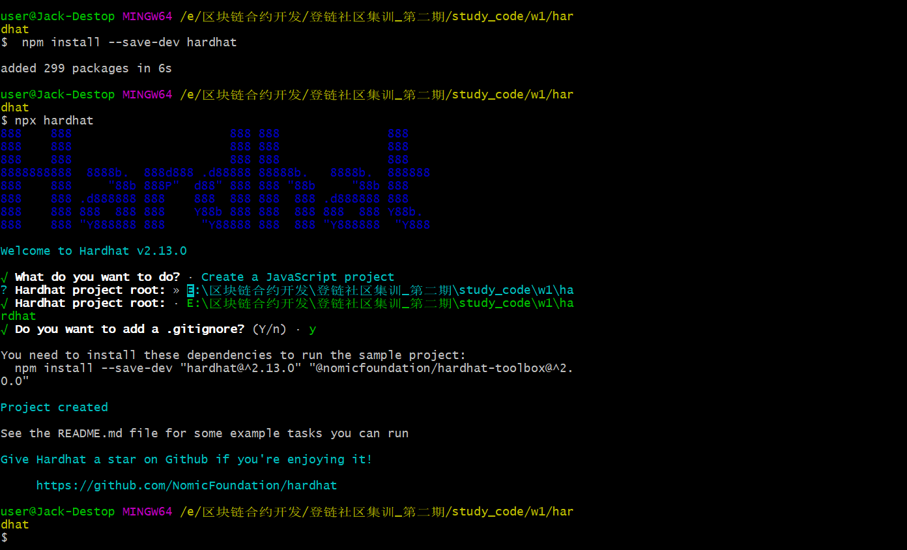
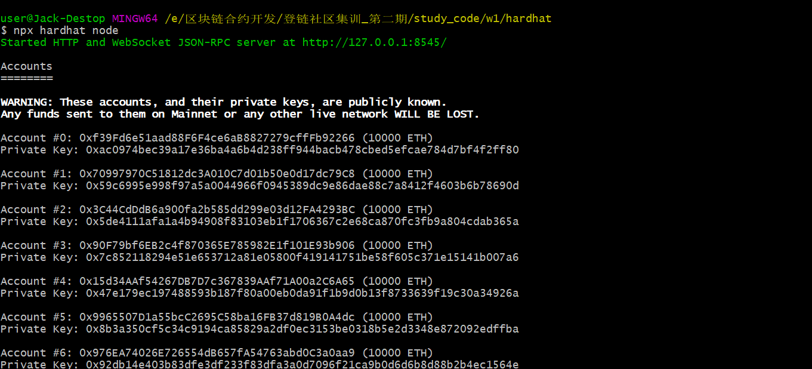
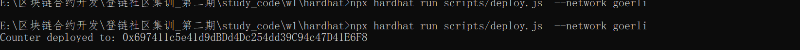

# hardhat部署项目

## 新建项目

进到到目录后

```shell
npm install --save-dev hardhat
npx hardhat
```





安装常用的插件

```shell
npm install --save-dev @nomiclabs/hardhat-waffle ethereum-waffle chai @nomiclabs/hardhat-ethers ethers
```

```shell
npm install --save-dev @nomicfoundation/hardhat-toolbox
```

## 部署合约

### 修改部署脚本

scripts/deploy.js

```javascript
const hre = require("hardhat");

async function main() {
  const currentTimestampInSeconds = Math.round(Date.now() / 1000);
  const unlockTime = currentTimestampInSeconds + 60;
  const Counter = await hre.ethers.getContractFactory("Counter");
  const counter = await Counter.deploy(unlockTime);
  await counter.deployed();

  console.log("Counter deployed to:", counter.address);
}

// We recommend this pattern to be able to use async/await everywhere
// and properly handle errors.
main().catch((error) => {
  console.error(error);
  process.exitCode = 1;
});
```


## 

配置网络

hardhat.config.js

```javascript
require("@nomicfoundation/hardhat-toolbox");

// 填入自己的私钥或助记词，
//本地私钥
const LOCAL_PRIVATE_KEY = "本地私钥,命令行获取";

const WALLET_PRIVATE_KEY = "goerli测试网络eoa地址的私钥(钱包中获取)";

// const Mnemonic = "YOUR Mnemonic";  //助记词

/** @type import('hardhat/config').HardhatUserConfig */
module.exports = {
  solidity: "0.8.9",
  networks: {

    localhost: {
      url: " http://127.0.0.1:8545",
      accounts: [LOCAL_PRIVATE_KEY],
      chainId: 1,
    },

    goerli: {
      url: "https://eth-goerli.api.onfinality.io/public",
      accounts: [WALLET_PRIVATE_KEY],
      chainId: 5,
    }
  }

};

```

### 部署到本地

启动本地节点

```shell
npx hardhat node 
```


启动部署脚本

npx hardhat run scripts/deploy.js --network <network-name>

```shell
 npx hardhat run scripts/deploy.js  --network localhost

```




### 远程到链上

npx hardhat run scripts/deploy.js  --network goerli




https://goerli.etherscan.io/address/0x697411c5e41d9dBDd4Dc254dd39C94c47D41E6F8

这样显示的合约是未开源的


源自

https://learnblockchain.cn/docs/hardhat/getting-started/

https://decert.me/tutorial/solidity/tools/hardhat