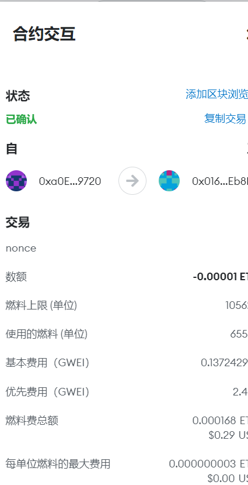
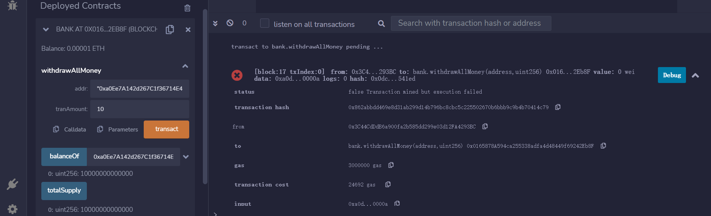
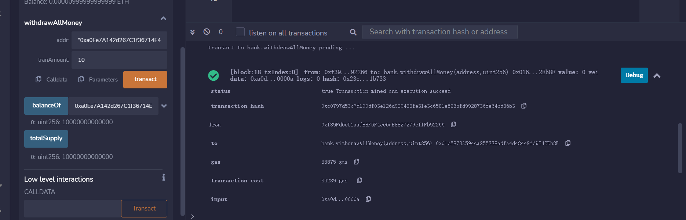

code


```javascript
// SPDX-License-Identifier: GPL-3.0
pragma solidity ^0.8.0;

contract bank {
    address private owner;
    address private sender;
    uint256 private amount;
    uint256 private _totalSupply;

    mapping(address => uint256) private _balances;

    constructor() {
        owner = msg.sender;
    }

    receive() external payable {
        _balances[msg.sender] = msg.value;
        _totalSupply += msg.value;
    }

    function balanceOf(address account)
        public
        view
        virtual
      
        returns (uint256)
    {
        return _balances[account];
    }

    function totalSupply() public view virtual  returns (uint256) {
        return _totalSupply;
    }


    function withdrawAllMoney(address addr, uint256 tranAmount)
        public
        // view
        virtual
    {
        require(msg.sender == owner, "you do not have the right to withdraw");
        (bool success, ) = addr.call{value: tranAmount}(new bytes(0));
        require(success, "Transfer finish");
    }
}

```

1部署合约

合约地址

 0x0165878A594ca255338adfa4d48449f69242Eb8F 


2 钱包向合约转账



3 非合约部署者提现失败



4 合约部署者 提现



钱包到账

